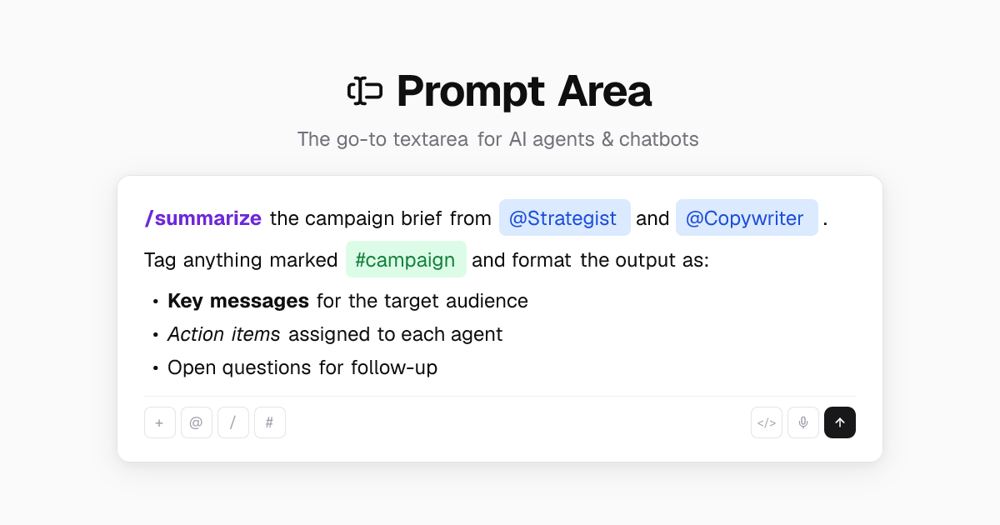

# Prompt Area



A production-grade contentEditable rich text input distributed as a [shadcn registry](https://ui.shadcn.com/docs/registry) component.

## Features

- **Trigger-based chips** — Type `@`, `/`, `#` (or any character) to activate dropdowns or callbacks
- **Immutable chip pills** — Resolved mentions, commands, and tags render as non-editable chips
- **Inline markdown** — Live preview of `**bold**`, `*italic*`, and `***bold-italic***`
- **URL detection** — Auto-links URLs with Cmd/Ctrl+Click to open
- **List auto-formatting** — Type `- ` or `* ` to start bullet lists with Tab/Shift+Tab indentation
- **Undo/redo** — Full history with debounced snapshots
- **Copy/paste** — Preserves chip data internally, auto-resolves triggers on external paste
- **IME support** — Proper composition handling for CJK input
- **Auto-grow** — Expands on focus, shrinks on blur
- **Keyboard shortcuts** — Bold, italic, submit, dismiss, and more
- **Imperative API** — `focus()`, `blur()`, `insertChip()`, `getPlainText()`, `clear()`
- **Zero extra dependencies** — Only React + your existing shadcn/tailwind setup

## Install

```bash
npx shadcn@latest add https://prompt-area.com/r/prompt-area.json
```

Add the required CSS classes to your `globals.css` after `@layer base`:

```css
@layer components {
  .prompt-area-chip {
    display: inline-flex;
    align-items: center;
    padding: 1px 6px;
    border-radius: 4px;
    font-size: 0.875rem;
    font-weight: 500;
    cursor: pointer;
    user-select: none;
    vertical-align: baseline;
    margin: 0 1px;
    background-color: var(--secondary);
    color: var(--foreground);
  }
  .prompt-area-md-marker {
    font-size: 0;
    display: inline;
  }
  .prompt-area-chip--inline {
    padding: 0;
    border-radius: 0;
    margin: 0;
    font-weight: 700;
  }
}
```

## Quick Start

```tsx
'use client'

import { useState } from 'react'
import { PromptArea } from '@/components/prompt-area'
import type { Segment, TriggerConfig } from '@/components/types'

const triggers: TriggerConfig[] = [
  {
    char: '@',
    position: 'any',
    mode: 'dropdown',
    onSearch: (query) =>
      [
        { value: 'alice', label: 'Alice' },
        { value: 'bob', label: 'Bob' },
      ].filter((u) => u.label.toLowerCase().includes(query.toLowerCase())),
  },
]

export function Chat() {
  const [segments, setSegments] = useState<Segment[]>([])

  return (
    <PromptArea
      value={segments}
      onChange={setSegments}
      triggers={triggers}
      placeholder="Type @ to mention someone..."
      onSubmit={(segs) => {
        console.log('Submitted:', segs)
        setSegments([])
      }}
    />
  )
}
```

## Props

### `PromptAreaProps`

| Prop           | Type                            | Default        | Description                                 |
| -------------- | ------------------------------- | -------------- | ------------------------------------------- |
| `value`        | `Segment[]`                     | required       | Controlled segment array                    |
| `onChange`     | `(segments: Segment[]) => void` | required       | Called on content changes                   |
| `triggers`     | `TriggerConfig[]`               | `[]`           | Trigger character configurations            |
| `placeholder`  | `string`                        | —              | Placeholder text when empty                 |
| `className`    | `string`                        | —              | CSS class for the container                 |
| `disabled`     | `boolean`                       | `false`        | Disable the input                           |
| `markdown`     | `boolean`                       | —              | Enable inline markdown rendering            |
| `onSubmit`     | `(segments: Segment[]) => void` | —              | Called on Enter (without Shift)             |
| `onEscape`     | `() => void`                    | —              | Called on Escape                            |
| `onChipClick`  | `(chip: ChipSegment) => void`   | —              | Called when a chip is clicked               |
| `onChipAdd`    | `(chip: ChipSegment) => void`   | —              | Called when a chip is added                 |
| `onChipDelete` | `(chip: ChipSegment) => void`   | —              | Called when a chip is deleted               |
| `onLinkClick`  | `(url: string) => void`         | —              | Called on Cmd/Ctrl+Click on a URL           |
| `onPaste`      | `(data) => void`                | —              | Called after paste with segments and source |
| `onUndo`       | `(segments: Segment[]) => void` | —              | Called after undo                           |
| `onRedo`       | `(segments: Segment[]) => void` | —              | Called after redo                           |
| `minHeight`    | `number`                        | `80`           | Minimum height in pixels                    |
| `maxHeight`    | `number`                        | —              | Maximum height in pixels                    |
| `autoFocus`    | `boolean`                       | `false`        | Auto-focus on mount                         |
| `autoGrow`     | `boolean`                       | `false`        | Expand on focus, shrink on blur             |
| `aria-label`   | `string`                        | `'Text input'` | Accessible label                            |
| `data-test-id` | `string`                        | —              | Test ID for e2e testing                     |

### `PromptAreaHandle` (ref)

| Method             | Description                        |
| ------------------ | ---------------------------------- |
| `focus()`          | Focus the editor                   |
| `blur()`           | Blur the editor                    |
| `insertChip(chip)` | Insert a chip at cursor position   |
| `getPlainText()`   | Get plain text content             |
| `clear()`          | Clear all content and undo history |

### `TriggerConfig`

| Field                | Type                                     | Description                                   |
| -------------------- | ---------------------------------------- | --------------------------------------------- |
| `char`               | `string`                                 | Trigger character (e.g., `'@'`, `'/'`, `'#'`) |
| `position`           | `'start' \| 'any'`                       | Where the trigger is valid                    |
| `mode`               | `'dropdown' \| 'callback'`               | Show dropdown or fire callback                |
| `onSearch`           | `(query: string) => TriggerSuggestion[]` | Fetch suggestions (dropdown mode)             |
| `onSelect`           | `(suggestion) => string \| void`         | Customize chip display text                   |
| `onActivate`         | `(context) => void`                      | Handler for callback mode                     |
| `resolveOnSpace`     | `boolean`                                | Auto-resolve on space (e.g., `#tag`)          |
| `chipStyle`          | `'pill' \| 'inline'`                     | Visual style for chips                        |
| `chipClassName`      | `string`                                 | CSS class for chips                           |
| `accessibilityLabel` | `string`                                 | ARIA label for the trigger                    |

### `Segment`

```ts
type Segment = TextSegment | ChipSegment

type TextSegment = { type: 'text'; text: string }

type ChipSegment = {
  type: 'chip'
  trigger: string // e.g., '@'
  value: string // e.g., 'user-123'
  displayText: string // e.g., 'Alice'
  data?: unknown
  autoResolved?: boolean
}
```

## Keyboard Shortcuts

| Shortcut            | Action                                   |
| ------------------- | ---------------------------------------- |
| `Enter`             | Submit (or continue list)                |
| `Shift+Enter`       | Insert newline                           |
| `Escape`            | Dismiss dropdown / fire onEscape         |
| `Cmd/Ctrl+B`        | Toggle **bold**                          |
| `Cmd/Ctrl+I`        | Toggle _italic_                          |
| `Cmd/Ctrl+Z`        | Undo                                     |
| `Cmd/Ctrl+Shift+Z`  | Redo                                     |
| `Tab` / `Shift+Tab` | Indent / outdent list item               |
| `ArrowUp/Down`      | Navigate dropdown suggestions            |
| `Backspace` on chip | Delete chip (or revert if auto-resolved) |

## Chip Customization

Style chips per-trigger using `chipClassName` and `chipStyle`:

```tsx
const triggers: TriggerConfig[] = [
  {
    char: '/',
    position: 'start',
    mode: 'dropdown',
    chipStyle: 'inline',
    chipClassName: 'text-violet-700 dark:text-violet-400',
    onSearch: searchCommands,
  },
  {
    char: '@',
    position: 'any',
    mode: 'dropdown',
    chipClassName: 'bg-blue-100 text-blue-700 dark:bg-blue-900 dark:text-blue-300',
    onSearch: searchUsers,
  },
]
```

## Development

```bash
pnpm install
pnpm dev            # Start dev server
pnpm test           # Run tests
pnpm build          # Production build
pnpm registry:build # Build registry JSON
```
